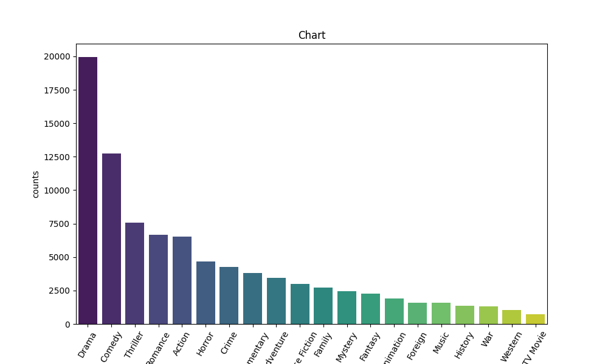

# Аналіз даних про фільми

У цьому файлі виконано поетапний аналіз датасету **movies_metadata.csv** з використанням бібліотек **pandas**, **matplotlib**, **seaborn** та **ast**. Нижче описано послідовність дій та результати.

## 🔹 Кроки аналізу

1. **Імпорт бібліотек**  
   Завантажено основні модулі для роботи з табличними даними, побудови графіків та обробки структурованих рядкових даних.

2. **Завантаження даних**  
   Датасет прочитано у DataFrame за допомогою `pd.read_csv()`.

3. **Первинний огляд даних**  
   - перегляд перших рядків (`head()`),  
   - отримання статистичних характеристик (`describe()`),  
   - перегляд типів даних та кількості ненульових значень (`info()`).

4. **Робота з окремими стовпцями**  
   - виведено стовпці *belongs_to_collection*, *homepage*, *tagline*;  
   - очищено дані від пропущених значень за допомогою кількох способів (`fillna()`, видалення рядків `dropna()`);  
   - замінено порожні значення у *homepage* та *tagline* на стандартні текстові значення;  
   - виконано перевірку залишкових `NaN`;  
   - підраховано сумарний бюджет фільмів.

5. **Обробка жанрів**  
   - створено функцію для перетворення рядків зі списками жанрів у Python-структури (`ast.literal_eval()`);  
   - застосовано перетворення до всього стовпця *genres*;  
   - здійснено «розгортання» списків жанрів у окремі рядки (`explode()`);  
   - підраховано частоти появи кожного жанру.

6. **Візуалізація**  
   На основі отриманих частот побудовано стовпчиковий графік розподілу жанрів за допомогою **seaborn** та **matplotlib**.

## 🔹 Висновок

За результатами аналізу встановлено, що **найпоширенішим жанром у датасеті є "Драма"**, що видно як зі статистики, так і з побудованої діаграми.

